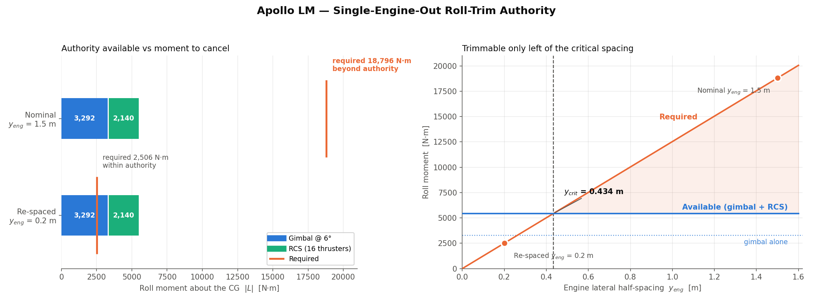
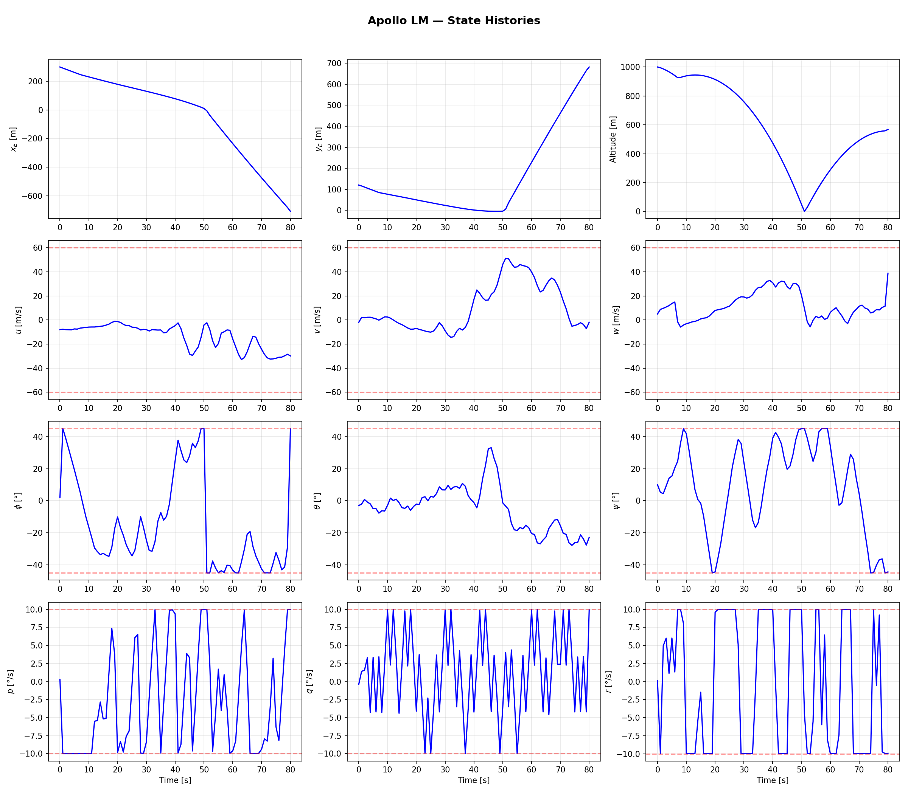
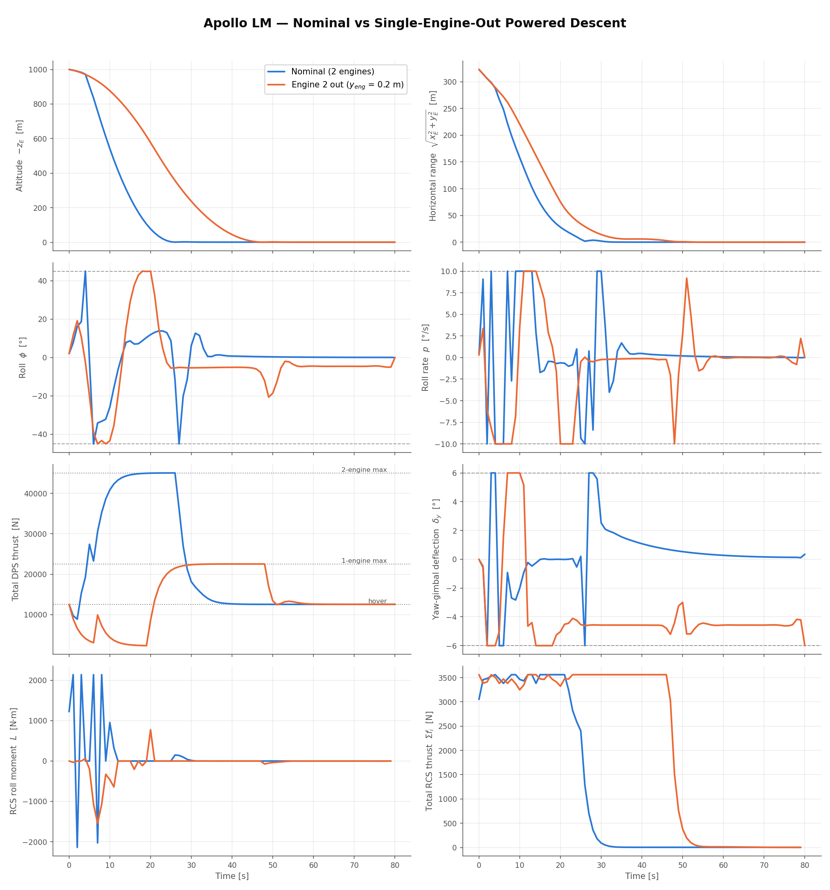
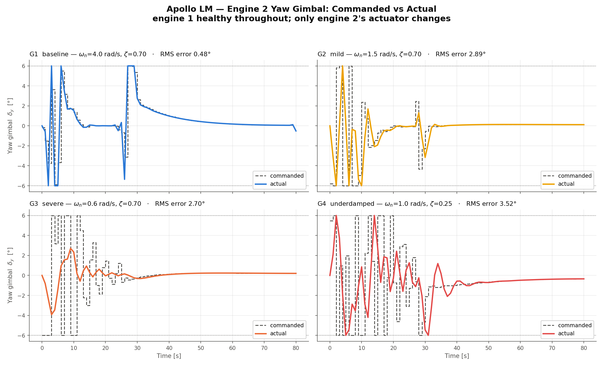
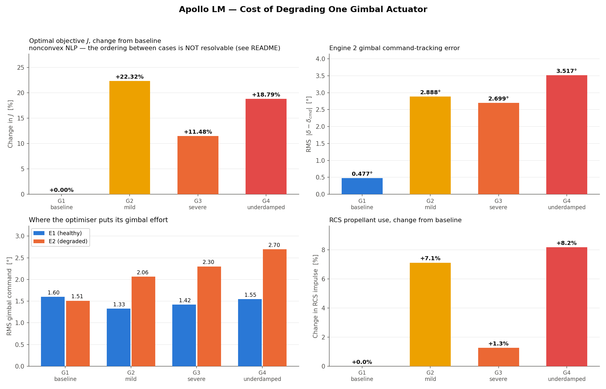
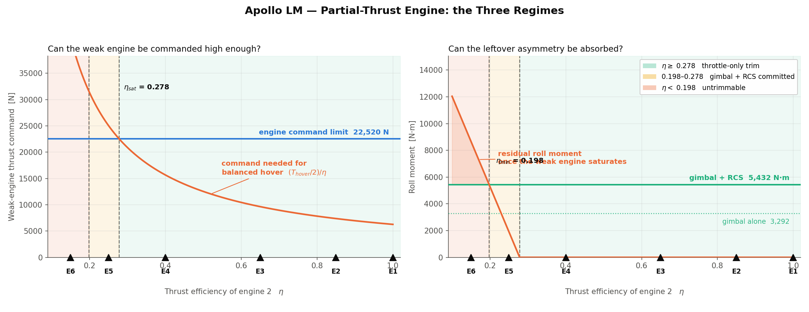
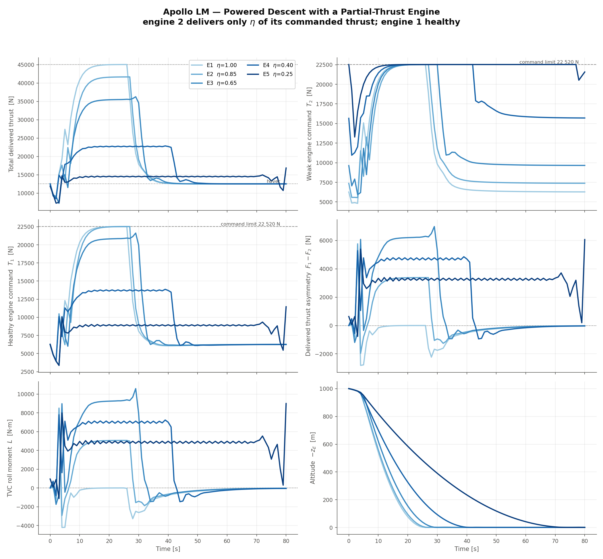
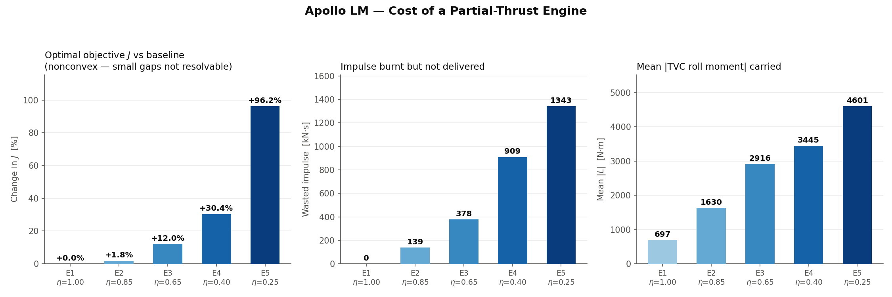

\newpage

# Scope

Three fault studies were run against the same 6-DOF powered-descent optimal
control problem (`apollo_full.py`), documented separately in
`apollo_full_documentation.pdf`. Thirteen solves in total:

| Study | Fault introduced | Runs | Outcome |
|---|---|---|---|
| **A** — Engine-out | one engine dead for the whole horizon | 3 | 2 land, 1 infeasible |
| **B** — Degraded gimbal | one gimbal actuator made sluggish | 4 | all 4 land |
| **C** — Thrust efficiency | one engine delivers only $\eta$ of its thrust | 6 | 4 land, 1 marginal, 1 infeasible |

Every run uses the identical vehicle, scenario, grid, and cost weights except
for the single fault parameter named. The baseline scenario starts 1 000 m above
and 323 m downrange of the pad, descending at 5 m/s, and has 80 s to reach a 1 m
contact altitude.

## The one-sentence result

**This vehicle fails through roll authority, not through thrust.** Both faults
that create a *thrust asymmetry* between the two laterally-spaced engines
(Studies A and C) drive the vehicle to the edge of controllability while leaving
thrust-to-weight comfortable. The fault that creates no asymmetry (Study B) is
benign.

## How the faults are modelled

Each fault is a small, backward-compatible addition to `apollo_full.py`; with
all of them at their defaults the nominal problem is bit-identical to before.

| Study | Parameter | Mechanism |
|---|---|---|
| A | `Scenario.failed_eng` | all five actuator states and all three commands of the named engine pinned to zero |
| B | `LMParams.gimbal_wn_eng`, `gimbal_zeta_eng` | per-engine $(\omega_n,\zeta)$ for the second-order gimbal servo |
| C | `LMParams.thrust_eff_eng` | delivered force is $\eta T$ while the actuator dynamics — and the propellant draw — still act on the full $T$ |

## Reproducibility protocol

The NLP is nonconvex, and this matters for comparing runs. Three solves of the
*identical* nominal problem under default multithreaded BLAS gave objectives of
2.8675e8, 2.8670e8 and 2.8391e8 — a **1.0 % spread**, because a change in
floating-point reduction order is enough to steer IPOPT into a different local
minimum. With `OMP_NUM_THREADS=1` (and the OpenBLAS/MKL equivalents) set before
numpy is imported, three solves gave 2.867018e8 to every printed digit and 168
iterations each.

Studies B and C pin threads in their drivers and are reproducible. **Study A was
run before this was discovered**, so its iteration counts and timings are
indicative rather than exact; none of its findings depend on them, being either
analytic or a feasible/infeasible verdict. Its baseline objective (2.8675e8) is
within 0.02 % of the pinned value, so it found the same minimum.

A residual caveat applies throughout and is quantified in §\ref{objective-caveat}:
pinning makes each run reproducible but does not make two *different*
configurations land in comparable minima.

\newpage

# Study A — Engine-Out

One of the two engines is dead for the whole horizon. Directory:
`engine_failure_case_study/`.

| # | Configuration | $J$ | Iters | Result |
|---|---|---|---|---|
| 1 | both healthy, $y_{eng}$ = 1.5 m | 2.8675e8 | 173 | **lands** |
| 2 | engine 2 dead, $y_{eng}$ = 1.5 m | — | 400 | **no solution** |
| 3 | engine 2 dead, $y_{eng}$ = 0.2 m | 5.3298e8 | 190 | **lands** |

## Why case 2 has no solution

Losing one engine halves thrust from 45 040 N to 22 520 N against a 12 530 N
hover requirement — thrust-to-weight only falls from 3.59 to 1.80, which is
ample. The landing is killed instead by the surviving engine sitting 1.5 m off
the centreline, applying a permanent roll moment. With the survivor at hover
trim,

$$
L = T\cos\delta_p\,\big(-y_{eng}\cos\delta_y + d_{z,eng}\sin\delta_y\big),
$$

where the second term is what the yaw gimbal buys back by tilting the thrust
vector against its own 2.5 m vertical arm:

| Term | Value |
|---|---|
| Roll moment to cancel ($\delta_y = 0$) | **18 796 N·m** |
| Gimbal can cancel (at its 6° limit) | 3 293 N·m |
| RCS can cancel (16 thrusters, best case) | 2 140 N·m |
| **Deficit** | **13 363 N·m** |

The residual 13.4 kN·m on $I_{xx} = 5368$ kg·m² is 2.49 rad/s² — 143 °/s² of
roll acceleration against a 10 °/s rate limit, violated in about 0.07 s. The NLP
is genuinely infeasible; this is not a solver-tuning issue. IPOPT exits
`Maximum_Iterations_Exceeded` with a **constraint violation of 2.62** still
outstanding, where cases 1 and 3 both reach $10^{-6}$.

The RCS figure deserves a note: it is the LP maximum over the thruster box,
$\sum_i \max(B_{3i},0)\,F_{\max}$. Summing $|B_{3i}|$ instead would double-count,
because a quad's up- and down-firing jets sit at the same radius and produce
equal-and-opposite roll, so only one of each pair helps.

{width=100%}

The case-2 figures are the final non-converged iterate, plotted for diagnosis
and **not a flyable trajectory**. They show a tumbling vehicle pinned against
every attitude limit at once — roll 44.8° at the 45° limit, all three body rates
saturated at ±10 °/s, 1 137 m off the pad at 49.0 m/s, still 568 m up. That is
the correct physical picture of an untrimmable roll moment.

{width=76%}

## The critical engine spacing

Setting required equal to available gives the design boundary:

$$
y_{crit} = d_{z,eng}\tan\delta_{y,\max} + \frac{L_{RCS,\max}}{T_{hover}}
         = 2.5\tan 6^\circ + \frac{2140}{12\,530}
         = 0.263 + 0.171 = \mathbf{0.434\ m}
$$

Engine-out flight is possible only for $y_{eng} \le 0.434$ m; the design value of
1.5 m is **3.5× beyond** it. Case 3 uses 0.2 m, inside the stricter bound
$y_{eng} \le d_{z,eng}\tan\delta_{y,\max} = 0.263$ m where the **gimbal alone**
can trim, leaving the RCS free for manoeuvring.

The prediction is confirmed by the solve: static trim at 0.2 m needs
$\delta_y = \arctan(0.2/2.5) = 4.57°$, and the converged solution parks the
survivor's yaw gimbal at a mean **4.65°**.

## What an engine-out landing costs

Case 3 lands cleanly — 0.001 m/s, 0.05° attitude error — but the descent differs
materially:

| Quantity | Nominal | Engine-out ($y_{eng}$=0.2 m) |
|---|---|---|
| Peak total DPS thrust | 45 036 N | 22 520 N (saturated) |
| Time to contact | about 26 s | about 47 s |
| Mean survivor yaw gimbal | 1.21° | 4.65° of 6° available |
| Total RCS impulse | 90 797 N·s | 171 124 N·s (**+88 %**) |

{width=80%}

Three consequences: the descent uses most of the 80 s horizon, so a shorter
horizon or more aggressive scenario would run out of margin; RCS propellant use
nearly doubles, which in a mass-tracking model would be the binding constraint;
and 78 % of the gimbal range is consumed by static trim, leaving about 1.35° for
manoeuvring.

## The design trade

The lateral offset is not free — it does useful work. Differential throttling at
$y_{eng} = 1.5$ m generates transient roll moments of ±4 000 N·m, roughly double
the entire RCS roll authority. Shrinking to 0.2 m cuts that by 7.5× and hands
the roll axis back to the RCS, the propellant-limited actuator. So:

* **large $y_{eng}$** — strong differential-throttle roll authority when healthy,
  no engine-out survivability;
* **small $y_{eng}$** — engine-out survivable, roll control dependent on RCS.

At $y_{eng} \le 0.263$ m the vehicle is survivable; above 0.434 m it is not.
In between it survives only by committing the RCS entirely to static trim. Note
that at 0.2 m the engines are only 0.4 m apart, raising plume-impingement and
packaging questions this model does not address.

**Case 3 answers "what spacing would have survived?", not "can the vehicle as
built survive?" — the answer to the second question is no.**

\newpage

# Study B — Degraded Gimbal

Engine 2's gimbal servo is made sluggish while engine 1 stays healthy. The
servo is $\ddot\delta = \omega_n^2(\delta_c-\delta) - 2\zeta\omega_n\dot\delta$
per axis. Directory: `gimbal_degradation_case_study/`.

| Case | $\omega_n$ | $\zeta$ | $-3$dB BW | Settling | Overshoot | $J$ | Iters |
|---|---|---|---|---|---|---|---|
| G1 | 4.0 rad/s | 0.70 | 4.04 rad/s | 1.4 s | 5 % | 2.867e8 | 168 |
| G2 | 1.5 rad/s | 0.70 | 1.52 rad/s | 3.8 s | 5 % | 3.507e8 | 390 |
| G3 | 0.6 rad/s | 0.70 | 0.61 rad/s | 9.5 s | 5 % | 3.196e8 | 270 |
| G4 | 1.0 rad/s | 0.25 | 1.48 rad/s | 16.0 s | 44 % | 3.406e8 | 284 |

G2 and G3 model lost bandwidth (degraded supply pressure, worn servo valve) so
the gimbal *lags*; G4 additionally loses damping so it *rings*. Only the gimbal
changes — thrust and the thrust lag are untouched.

{width=100%}

## All four land

Every case reaches contact with terminal speed below $10^{-5}$ m/s, zero
horizontal error, and attitude error below $10^{-4}$ °. This is the opposite of
Study A: the vehicle has redundant roll/pitch authority — a second gimbal,
differential throttling, 16 RCS thrusters — so the optimiser routes around a
slow actuator. It cannot route around a moment it has no authority to cancel.

Peak roll is 45.00° and peak roll rate 10.00 °/s in *every* case including
baseline: the degradation does not change the active constraint set, only the
cost of respecting it.

## Tracking error grows roughly six-fold

| Metric | G1 | G2 | G3 | G4 |
|---|---|---|---|---|
| E2 gimbal RMS tracking error | 0.477° | 2.888° | 2.699° | 3.517° |
| E2 gimbal *max* tracking error | 2.365° | 12.000° | 9.925° | 12.000° |
| **E2 RMS gimbal command** | **1.510°** | **2.065°** | **2.300°** | **2.697°** |
| **E1 RMS gimbal command** | **1.600°** | **1.328°** | **1.420°** | **1.547°** |
| RCS impulse | 91 068 N·s | 97 544 N·s | 92 218 N·s | 98 510 N·s |
| Peak differential thrust | 5 659 N | 4 263 N | 5 905 N | 5 260 N |

The maximum error of exactly 12.000° in G2 and G4 is full scale: the command
sits at one ±6° limit while the actual deflection sits at the other. The
actuator is, at moments, doing the precise opposite of what it was told.

{width=100%}

## The compensation is counterintuitive

The natural expectation is that the optimiser abandons the bad actuator and
leans on the healthy one. **It does the opposite.** The RMS command sent to the
degraded gimbal rises monotonically with severity (1.51° → 2.70°) while the
healthy engine's command *falls* (1.60° → 1.33–1.55°). RCS use moves by only
+1.3 % to +8.2 %; differential thrust shows no trend at all.

The reason is that a sluggish actuator **attenuates**: to obtain a given
deflection you must over-drive it. The optimiser therefore commands harder, not
elsewhere. This is the most robust quantitative finding in the study — it held
in the same direction and magnitude across two independent solve campaigns,
unlike the objective.

{width=100%}

## The mechanism, and its caveat

The command grid updates once per second, so its Nyquist rate is
$\pi/\Delta t = 3.14$ rad/s. The healthy actuator's $-3$ dB bandwidth is
4.04 rad/s — above that, so it can follow anything the optimiser may command.
All three degraded actuators sit below it (1.52, 0.61, 1.48 rad/s) and act as
low-pass filters. The optimiser exploits this: it issues a fast, large-amplitude
command whose *filtered* response is the deflection profile it wants.

That is physically real, but two caveats apply to reading it as a hardware
prediction:

1. **The commands are not realistic GNC outputs.** No flight autopilot commands
   ±6° square waves at 1 Hz. The optimiser can because the cost penalises the
   *commanded* rate ($R_d$ on $\Delta u$) rather than the achieved deflection
   rate, and $R_d$ was tuned for the healthy actuator. Penalising $\dot\delta$ as
   a state, or re-tuning $R_d$ per engine, would suppress the chatter and
   probably raise the measured cost of degradation.
2. **The result is grid-dependent.** A finer grid would let the optimiser chatter
   faster and be filtered harder. This cuts opposite to the baseline model's usual
   concern: $\Delta t = 1$ s under-resolves the *healthy* actuator
   ($\omega_n = 4$ rad/s) but comfortably resolves the sluggish ones, so the
   degraded cases are the better-resolved of the four.

\newpage

# Study C — Thrust Efficiency

Engine 2 delivers $F = \eta T$ while its propellant draw still follows the full
$T$ — the shortfall is lost power, not saved fuel. Directory:
`thrust_efficiency_case_study/`.

| Case | $\eta$ | Regime | $J$ | $\Delta J$ | Iters | Result |
|---|---|---|---|---|---|---|
| E1 | 1.00 | baseline | 2.867e8 | — | 168 | lands |
| E2 | 0.85 | I | 2.919e8 | +1.8 % | 208 | lands |
| E3 | 0.65 | I | 3.211e8 | +12.0 % | 199 | lands |
| E4 | 0.40 | I | 3.737e8 | +30.4 % | 192 | lands |
| E5 | 0.25 | II | 5.626e8 | +96.2 % | 204 | **misses landing gate** |
| E6 | 0.15 | III | — | — | 400 | **no solution** |

## The binding constraint is the asymmetry, not the lost thrust

Even at $\eta = 0.15$ the vehicle retains 25 898 N of delivered thrust against
12 530 N of hover requirement — thrust-to-weight 2.07, ample on paper. It still
cannot land, because the engines sit at $y = \pm 1.5$ m and unequal *delivered*
thrust is a roll moment.

Balanced hover needs both engines to deliver $T_{hover}/2$, so the weak one must
be commanded at $(T_{hover}/2)/\eta$ — bounded by $T_{\max,eng}$. That gives the
first boundary, and the residual roll moment after saturation gives the second:

$$
\eta_{sat} = \frac{T_{hover}/2}{T_{\max,eng}} = \frac{6265}{22\,520} = \mathbf{0.278},
\qquad
\eta_{min} = \frac{T_{hover} - L_{auth}/y_{eng}}{2\,T_{\max,eng}} = \mathbf{0.198}
$$

| Regime | Condition | Behaviour |
|---|---|---|
| I | $\eta \ge 0.278$ | trimmable by differential throttling alone; gimbal and RCS stay free |
| II | $0.198 \le \eta < 0.278$ | trimmable only with gimbal and RCS committed to static trim |
| III | $\eta < 0.198$ | residual roll moment exceeds all authority — infeasible |

The authority is evaluated **at hover** deliberately: the gimbal's roll capacity
is $\big(\sum_i F_i\big)d_{z,eng}\tan\delta_{y,\max}$, so it scales with
delivered thrust and is weakest at hover — precisely where the vehicle must end
up. During high-thrust braking the same solutions carry 7 000–10 500 N·m without
difficulty.

{width=100%}

## Regime I is graceful; the penalty is propellant

| Metric | $\eta$=1.00 | 0.85 | 0.65 | 0.40 | 0.25 |
|---|---|---|---|---|---|
| Peak delivered thrust [N] | 45 036 | 41 658 | 36 254 | 22 867 | 16 848 |
| Mean weak-engine command [N] | 10 757 | 11 411 | 13 340 | 18 697 | **22 101** |
| Impulse burnt [N·s] | 1.716e6 | 1.762e6 | 1.919e6 | 2.289e6 | 2.486e6 |
| Impulse delivered [N·s] | 1.716e6 | 1.623e6 | 1.540e6 | 1.380e6 | 1.144e6 |
| **Wasted impulse [N·s]** | 0 | 1.39e5 | 3.78e5 | 9.09e5 | **1.34e6** |
| Mean \|TVC roll moment\| [N·m] | 697 | 1 630 | 2 916 | 3 445 | 4 601 |
| Mean \|yaw gimbal\| [°] | 1.22 | 1.63 | 3.13 | 3.95 | **5.75** |
| RCS impulse [N·s] | 91 068 | 97 353 | 107 900 | 147 380 | **274 533** |
| Time to contact [s] | 26 | 27 | 30 | 41 | **74** |
| Terminal speed [m/s] | 3.8e-6 | 5.9e-6 | 2.6e-6 | 6.0e-6 | 0.193 |
| Terminal attitude error [°] | ~0 | ~0 | ~0 | ~0 | **5.95** |

For $\eta \ge 0.40$ every case lands to full precision. The optimiser commands
the weak engine higher and equalises the *delivered* thrusts; roll trim costs
nothing extra. What it costs is propellant: at $\eta = 0.40$ the vehicle burns
2.289e6 N·s to deliver 1.380e6 — **909 kN·s, about 40 %, wasted**. The descent
also slows, contact taking 41 s rather than 26 s.

{width=78%}

## Regime II converges but does not land acceptably

$\eta = 0.25$ behaves exactly as the regime analysis predicts, on three
independent signals: the weak engine's mean command is 22 101 N against a
22 520 N limit (saturated throughout); mean yaw gimbal is 5.75° of 6° available
(**96 % of range consumed by static trim**); RCS impulse triples.

The NLP converges, but the landing criteria are **not met** — touchdown attitude
error 5.95° against the 5° gate, 0.193 m/s residual speed. With the gimbal
saturated and the RCS committed there is nothing left to null the roll. Contact
also takes 74 s of the 80 s horizon.

**The practical limit is therefore $\eta \approx 0.28$, not 0.198.** The 0.198
boundary is where a solution stops *existing*; 0.278 is where an *acceptable
landing* stops existing — and it coincides with $\eta_{sat}$, the point where
differential throttling can no longer equalise the delivered thrusts. For design
purposes the latter is the number that matters.

At $\eta = 0.15$ the residual roll moment is 8 662 N·m against 5 432 N·m of
authority — a deficit of 3 229 N·m. IPOPT exits at the iteration cap with a
constraint violation of 0.393 outstanding; the final iterate is 34.2° off in
attitude at 25.5 m/s.

{width=100%}

\newpage

# Synthesis

## The common failure mode

| Study | Fault | Creates asymmetry? | Failure mode |
|---|---|---|---|
| A | one engine dead | yes, total | **roll authority** — infeasible at design spacing |
| B | one slow gimbal | no | none — graceful, order 10–20 % in $J$ |
| C | one weak engine | yes, partial | **roll authority** — unacceptable below $\eta \approx 0.28$ |

Both thrust-related faults fail through roll, and both fail because of the
lateral spacing $y_{eng} = 1.5$ m rather than through any shortage of thrust. In
Study A thrust-to-weight was still 1.80; in Study C's worst case it was 2.07.
Neither is short of thrust. The gimbal fault is benign precisely because it
creates no asymmetry — it only makes one actuator slower to respond.

The two studies also agree quantitatively on the mechanism. Both find the
surviving or dominant engine's yaw gimbal parked on a static-trim shelf near its
limit (4.65° of 6° in Study A case 3; 5.75° of 6° in Study C E5), and both find
RCS impulse roughly doubling or tripling when the asymmetry must be held
continuously.

## Design implication

The 1.5 m spacing was chosen to give differential-throttle roll authority when
both engines are healthy — and it does, ±4 000 N·m, roughly double the entire
RCS roll budget. But that same moment arm converts *any* thrust asymmetry into a
trim problem the vehicle cannot absorb. The spacing is simultaneously the
vehicle's best roll actuator and its single point of failure.

Two boundaries quantify the trade:

* $y_{eng} \le 0.263$ m makes the vehicle single-engine-out survivable on gimbal
  trim alone (0.434 m if the RCS is committed);
* at $y_{eng} = 1.5$ m, thrust efficiency on either engine must stay above
  $\eta \approx 0.28$ for an acceptable landing.

A smaller spacing would relax the $\eta$ tolerance in exactly the way it
restored engine-out survivability. The cost is that roll control falls back on
the RCS, which is propellant-limited.

## Reliability of the objective comparisons {#objective-caveat}

Pinning threads makes each solve reproducible but does **not** make two different
configurations land in comparable local minima. Comparing the two independent
campaigns run for Study B:

| Case | Campaign 1 | Campaign 2 | Difference |
|---|---|---|---|
| G1 | 2.8391e8 | 2.8670e8 | 1.0 % |
| G2 | 3.1755e8 | 3.5069e8 | **10.4 %** |
| G3 | 3.1956e8 | 3.1960e8 | 0.01 % |
| G4 | 3.4181e8 | 3.4058e8 | 0.4 % |

G2 moved 10.4 % between campaigns — comparable to the entire spread *between*
cases. Consequently:

* **Study B's objective ordering is not resolvable.** Campaign 1 happened to be
  monotone in severity (+11.9 %, +12.6 %, +20.4 %), which invited the conclusion
  that losing damping costs more than losing bandwidth. Campaign 2 (+22.3 %,
  +11.5 %, +18.8 %) does not support it, and that conclusion was withdrawn. The
  defensible statement is "order 10–20 % in objective, ranking unresolved".
* **Study C's objective trend is safe.** The effects (+1.8 % to +96.2 %) are
  large, monotone in $\eta$, and corroborated by independent physical measures
  (wasted impulse, gimbal deflection, RCS impulse) that all move monotonically.
  The +1.8 % entry alone would not be resolvable.
* **Study A's verdicts do not rest on objectives at all** — they are analytic
  bounds plus feasible/infeasible outcomes.

Resolving the rankings properly needs a multi-start: solve each case from a
spread of initial guesses and keep the best minimum. That is the standard remedy
and the natural next step.

# Shared limitations

These apply to all three studies and to the underlying model.

**Constant mass and inertia.** No $\dot m = -T/(I_{sp}g_0)$ state; the CG never
shifts. Over an 80 s burn this is a few percent of vehicle mass — defensible for
a planner, but it means no study minimises fuel in the true sense. **It matters
most in Study C**, where the wasted impulse at $\eta = 0.25$ (1.34e6 N·s) is
comparable to the entire delivered impulse and corresponds to roughly 440 kg of
extra propellant at $I_{sp} \approx 311$ s on a 7 711 kg vehicle. A mass-tracking
model might run out of propellant before it runs out of roll authority, so the
propellant consequence of a partial-thrust engine is **understated** here. A CG
shift would also change the roll-trim arithmetic directly.

**All faults are present from $t = 0$ and known to the optimiser.** Every study
therefore answers "how well can a known-degraded vehicle be flown?", not "can the
vehicle respond to a degradation?" A fault appearing mid-descent would be a
transient recovery problem from a worse state, and the open-loop OCP cannot
represent detection delay.

**No failure transients.** No thrust decay tail, residual thrust, gimbal
hardover, or actuator slew-rate saturation. The last is a real omission in Study
B: a hard rate limit is a nonlinearity that would hurt more than the modelled
loss of bandwidth, and would block the over-commanding strategy the optimiser
relies on.

**Open loop throughout.** These are reference trajectories plus feedforward
commands, with no disturbance rejection and no navigation error model. A
tracking controller sits downstream of this.

**Continuous RCS.** Thruster forces are continuous in $[0, 445]$ N rather than
on/off pulse-width modulated — the standard relaxation that keeps the NLP smooth,
but it makes the commanded profiles pulse-width *equivalents* rather than
realisable firing commands.

**Fixed horizon.** 80 s is imposed, not optimised. Studies A and C both produce
cases that use 47 s and 74 s of it, so the horizon is closer to binding than the
nominal case suggests.

**Euler angles**, fine here because $|\theta| \le 45°$ is enforced, well away
from gimbal lock.

\newpage

# Appendix — files and reproduction

## Directory layout

Every case directory contains `states.png`, `controls.png`, `actuators.png`,
`thrusters.png`, `trajectory_with_axes.png`, the full solver transcript
`console_log.txt`, and the raw arrays `solution.npz`. Studies B and C also write
`metrics.json` per case and a `summary.json` at the study root.

| Study | Directory | Cases |
|---|---|---|
| A | `engine_failure_case_study/` | `01_nominal_2_engines`, `02_engine_out_nominal_geometry`, `03_engine_out_survivable_geometry` |
| B | `gimbal_degradation_case_study/` | `G1_nominal`, `G2_mild_wn1.5`, `G3_severe_wn0.6`, `G4_underdamped_wn1.0_zeta0.25` |
| C | `thrust_efficiency_case_study/` | `E1_eta1.00` … `E6_eta0.15` |

## Cross-case figures

| Figure | Study | Shows |
|---|---|---|
| `roll_authority_budget.png` | A | roll authority against demand; critical spacing |
| `nominal_vs_engine_out.png` | A | nominal against engine-out trajectories |
| `actuator_step_response.png` | B | the four actuator models, analytically |
| `gimbal_tracking.png` | B | commanded against actual gimbal, per case |
| `degradation_metrics.png` | B | objective, tracking error, effort split, RCS |
| `efficiency_regime_map.png` | C | the three regimes and their boundaries |
| `efficiency_comparison.png` | C | converged trajectories overlaid |
| `efficiency_cost.png` | C | objective, wasted impulse, roll moment carried |

## Reproduction

```bash
cd engine_failure_case_study
python run_case_study.py            # 3 cases, about 4 min
python plot_roll_authority.py
python plot_comparison.py

cd ../gimbal_degradation_case_study
python run_gimbal_study.py          # 4 cases, about 8 min
python plot_actuator_response.py
python plot_gimbal_comparison.py

cd ../thrust_efficiency_case_study
python run_efficiency_study.py      # 6 cases, about 12 min
python plot_regime_map.py
python plot_efficiency_comparison.py
```

The B and C drivers pin `OMP_NUM_THREADS=1` themselves. To reproduce Study A
under the same protocol, export it before running — the verdicts will not change,
but the iteration counts will become repeatable.

Requirements: `casadi`, `numpy`, `matplotlib`. The model itself and its full
derivation are documented in `apollo_full_documentation.pdf`.
