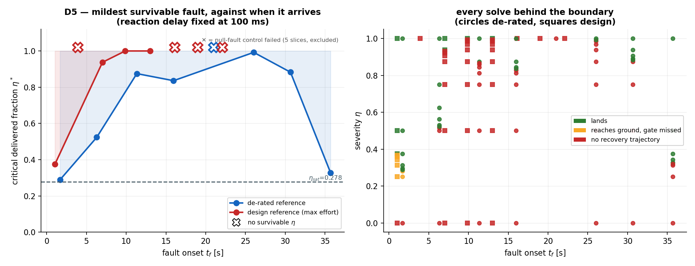
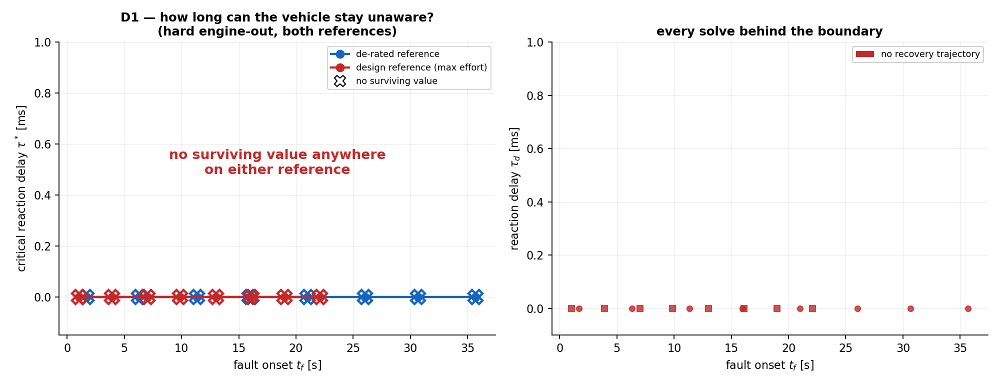
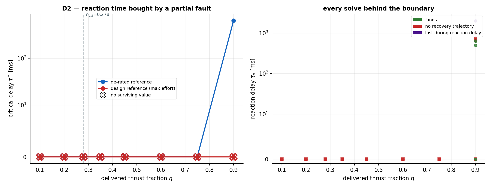
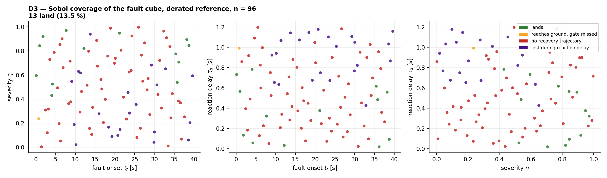
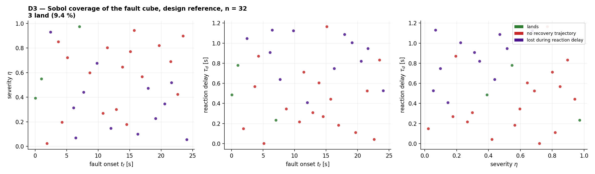
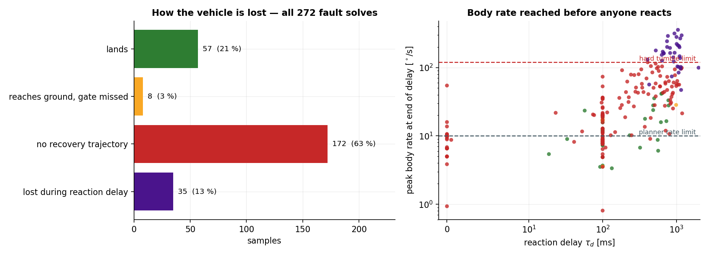
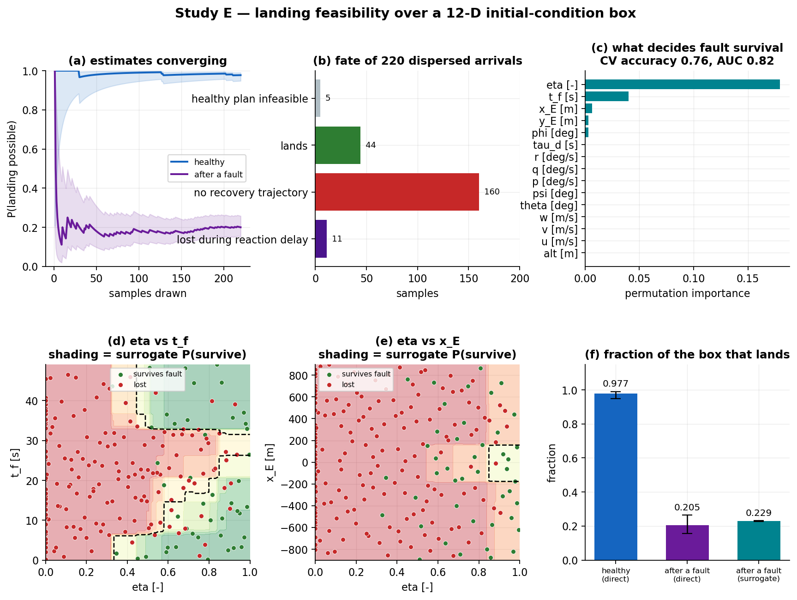

\newpage

# What this adds to the earlier case studies

Studies A, B and C answered *"how well can a known-degraded vehicle be flown?"*
Every fault in them was present from $t = 0$ and known to the planner, and each
study was a handful of solves at hand-picked parameter values. Two questions
were left open, and both live in **continuous** spaces that cannot be
enumerated:

1. **A healthy vehicle breaks mid-descent.** The fault arrives at a continuous
   onset time $t_f$, with a continuous severity $\eta$, and is acted on only
   after a continuous reaction delay $\tau_d$. Does it cause a failure?
2. **The vehicle does not always start where the design case says.** Given a
   12-dimensional dispersion box of arrival states, for what fraction is a
   landing possible *at all* — and for what fraction is it still possible once
   something breaks?

Both are volume questions over uncountable sets, and each sample costs a
nonlinear-programme solve taking tens of seconds. Neither can be answered
exactly. This study estimates them, and states the estimation error rather than
hiding it.

| | Question | Space searched | Solves |
|---|---|---|---|
| **D** | does a mid-descent fault cause a failure? | $(t_f, \eta, \tau_d)$, two reference profiles | 272 |
| **E** | can it land from anywhere in the dispersion box? | 12-D box $\times$ fault draw | 220 arrivals |

# Method

## The fault-response protocol

Each sample is a six-stage experiment, not a single solve. That structure is
the point: it separates *the fault being unrecoverable* from *nobody reacting
in time*, which a single degraded-from-$t_0$ solve cannot distinguish.

1. **Nominal plan.** Solve the healthy OCP from $x_0$, giving $(X_{nom},
   U_{nom})$. If it fails, the initial condition itself is infeasible and
   there is no fault question to ask.
2. **Fly to $t_f$.** Replay the nominal commands on the healthy dynamics up to
   the exact onset time. $t_f$ is *not* snapped to the 1 s control grid — the
   state is re-integrated at 0.02 s from the grid node below it, so the onset
   axis is genuinely continuous.
3. **Fault, then blindness.** The fault engages. The vehicle keeps applying the
   *stale* nominal command for $\tau_d$ seconds, now on an asymmetric vehicle.
   Nothing is compensating during this window.
4. **Hard-loss check.** If the delay leaves the vehicle tumbling, past
   horizontal, or on the ground, it is lost before any replan could act — and
   this is recorded without spending a solve.
5. **Replan.** Re-solve from the post-delay state, with the degraded vehicle,
   on the time remaining.
6. **Touchdown gate.** Cut the engine at contact, settle ballistically, and
   score the touchdown.

## Two thresholds, deliberately different

A recurring trap in this kind of study is to treat the planner's own path
constraints as the definition of a crash. They are not. $\omega_{max} =
10^\circ$/s and $45^\circ$ of attitude are comfort limits chosen when the OCP
was posed; a vehicle briefly outside them has not been lost.

* **Hard loss of control** (ends the sample immediately): tilt past
  $90^\circ$, any body rate past $120^\circ$/s, per-axis speed past
  $1.5\,V_{max}$, or ground contact. These are conditions with no way back.
* **Landing gate** (scored at touchdown, after the engine-off settle):
  vertical speed $\le 3.0$ m/s, horizontal $\le 1.2$ m/s, tilt $\le
  6^\circ$, distance from pad $\le 15$ m, body rates $\le 5^\circ$/s.

Everything between the two is handed to the optimiser, so that *it* decides
whether a recovery exists.

## Two reference profiles

The descent flown in Studies A–C is a **maximum-effort** trajectory. It rides
$V_{max}$ on the descent axis and saturates **all three** body-rate channels
simultaneously, reaching contact in 26 s. Everything in Study D was therefore
run twice: once on that *design* reference, and once on a **de-rated**
reference — same vehicle, same initial condition, same cost, but with the
planner's limits pulled in ($V_{max}$ 60 $\to$ 30 m/s, $\omega_{max}$ 10
$\to$ 5$^\circ$/s), reaching contact in 42 s.

Running only the design profile would have shown that it cannot absorb faults
without showing *why*. The pair separates a property of the vehicle from a
property of the trajectory it happens to be flying, and that turned out to be
the study's main result.

## The recovery corridor, and two artefacts that had to be removed first

Getting a *meaningful* answer required eliminating two effects that had nothing
to do with the physics. Both are recorded here because either one, left in,
would have produced a confident and completely wrong conclusion.

**The corridor.** Because the design reference sits exactly on $V_{max}$ and
on all three rate limits, a replan imposing those same bounds from its first
node is infeasible for *any* fault — the vehicle is not permitted to exceed
$10^\circ$/s for even one grid step while absorbing a disturbance. The replan
instead flies inside a corridor: each bound starts at the larger of the
post-fault excursion and a transient allowance ($3\times$ the rate limit,
$1.35\times$ attitude, $1.2\times$ velocity — all far inside the hard-loss
thresholds) and is tightened linearly back to the design envelope over six
seconds. This is a *demand*, not a dispensation: the planner must demonstrably
be back inside the envelope within six seconds.

**The forced hover tail.** Giving the replan every remaining second up to the
80 s mission deadline forces it to hover on the 1 m contact-altitude floor for
the whole unused tail — roughly 50 s of holding a hard constraint boundary
exactly, on a 1 s RK4 grid. That is a pathological arc, and it was observed to
turn otherwise-recoverable faults infeasible. The replan is instead given the
nominal's own remaining descent time plus a 20 s reserve, still capped by the
80 s deadline.

Both were diagnosed rather than assumed. A constraint-group ablation on one
failing replan showed that relaxing the altitude floor *alone*, the rate limit
*alone*, or the glide cone *alone* each converted the same infeasible problem
into a converged landing in 116–174 IPOPT iterations — no single constraint was
responsible, which is the signature of a reference with no slack rather than of
a genuinely unrecoverable fault.

## Searching an infinite space with a finite budget

Three techniques, each doing something the others cannot.

**Bisection** on the axis that decides survival. Nine solves per slice resolve a
boundary to 1/128 of its bracket; a uniform grid of nine points resolves it to
1/8. Bisection assumes survival is monotone along that axis — more blind time
is never better, more delivered thrust is never worse — which is checked
independently below.

**Sobol sampling** of the full cube. Low-discrepancy points give integration
error scaling like $O(\log^d N / N)$ rather than the $O(N^{-1/2})$ of plain
Monte Carlo, which matters at $N \sim 10^2$. Crucially it assumes *nothing*
about monotonicity, so it is what tests the bisection's premise.

**A cross-validated surrogate** for the 12-D volume in Study E: a
gradient-boosted classifier fitted to the samples and integrated over 200 000
cheap points. Its out-of-fold accuracy is reported next to the volume it
produces, because a surrogate volume is worth exactly what the classifier is
worth.

Every reported fraction carries a **Wilson score interval**, which behaves near
0 and 1 where the normal approximation does not.

## Reproducibility

Every solve runs with `OMP_NUM_THREADS=1`. Study B established that
multithreaded BLAS makes this NLP's objective non-reproducible at the ~1 %
level; parallelism here is across samples instead, so each individual solve is
deterministic. IPOPT's own return status is recorded for every solve, so
`Maximum_Iterations_Exceeded` is never silently reported as infeasibility.

\newpage

# Study D — faults that arrive mid-descent

## D5 — the mildest survivable fault, against when it arrives

This is the study's central sweep and the most direct answer to the question
"does a fault after some time cause a failure?". At each onset time, with the
reaction delay fixed at a realistic 100 ms, bisection in severity locates
$\eta^*(t_f)$: the smallest delivered-thrust fraction the vehicle still
survives. A fault milder than $\eta^*$ is absorbed; anything worse is not.

| design onset $t_f$ [s] | design result | de-rated onset $t_f$ [s] | de-rated result |
|---:|---:|---:|---:|
| 1.0 | 0.375 | 1.7 | 0.289 |
| 3.9 | **none** | 6.3 | 0.523 |
| 7.0 | 0.938 | 11.3 | 0.875 |
| 9.9 | 1.000 | 16.0 | 0.836 |
| 13.0 | 1.000 | 21.0 | **none** |
| 16.1 | **none** | 26.0 | 0.992 |
| 19.0 | **none** | 30.7 | 0.883 |
| 22.1 | **none** | 35.7 | 0.328 |

{width=\linewidth}

## D1 — how long can the vehicle stay unaware? (hard engine-out)

For each onset time, bisection on the reaction delay looks for $\tau^*(t_f)$:
the longest the vehicle can keep flying the stale command and still land.

| design onset $t_f$ [s] | design result | de-rated onset $t_f$ [s] | de-rated result |
|---:|---:|---:|---:|
| 1.0 | **none** | 1.7 | **none** |
| 3.9 | **none** | 6.3 | **none** |
| 7.0 | **none** | 11.3 | **none** |
| 9.9 | **none** | 16.0 | **none** |
| 13.0 | **none** | 21.0 | **none** |
| 16.1 | **none** | 26.0 | **none** |
| 19.0 | **none** | 30.7 | **none** |
| 22.1 | **none** | 35.7 | **none** |

{width=\linewidth}

## D2 — reaction time bought by a partial fault

The same delay bisection across a continuous severity sweep. $\eta_{sat} =
0.278$ is the saturation limit derived in Study
C: below it the weak engine cannot be throttled back up to match its partner.

| delivered fraction $\eta$ | design reference | de-rated reference |
|---:|---:|---:|
| 0.10 | **none** | **none** |
| 0.20 | **none** | **none** |
| 0.28 | **none** | **none** |
| 0.35 | **none** | **none** |
| 0.45 | **none** | **none** |
| 0.60 | **none** | **none** |
| 0.75 | **none** | **none** |
| 0.90 | **none** | 641 ms |

{width=\linewidth}

## D3 — Sobol coverage of the whole cube, de-rated reference

96 low-discrepancy points over $(t_f, \eta, \tau_d)$, assuming nothing
about the shape of the boundary. 13 land:
**0.135 [0.081, 0.218]** (95 % Wilson).

| outcome | samples | share |
|---|---:|---:|
| land | 13 | 13.5 % |
| gate miss | 1 | 1.0 % |
| no replan | 60 | 62.5 % |
| lost in delay | 22 | 22.9 % |

{width=\linewidth}

## D3 — Sobol coverage of the whole cube, design reference

32 low-discrepancy points over $(t_f, \eta, \tau_d)$, assuming nothing
about the shape of the boundary. 3 land:
**0.094 [0.032, 0.242]** (95 % Wilson).

| outcome | samples | share |
|---|---:|---:|
| land | 3 | 9.4 % |
| no replan | 17 | 53.1 % |
| lost in delay | 12 | 37.5 % |

{width=\linewidth}

## How the vehicle is lost

{width=\linewidth}

\newpage

# Study E — can it land from anywhere in the dispersion box?

## The box

A 12-dimensional arrival dispersion: $\pm 500$ m down- and cross-range, a
400–1400 m altitude band, body velocities spanning $[-25, 10] \times [-12, 12]
\times [-5, 28]$ m/s, attitudes to $\pm 20^\circ$ (yaw $\pm 40^\circ$) and
rates to $\pm 4^\circ$/s. Points violating the glide cone or the flight
envelope are not *failures* — they are not legal initial conditions, and are
rejected before sampling so the estimate is a statement about flyable
dispersions.

Study E is flown on the **de-rated** reference. Study D establishes that the
design profile has no fault margin at any onset, so running the fault half of
Study E on it would be estimating a quantity already known to be zero.

220 admissible Sobol points were flown. Each cost a healthy solve (is a
landing possible at all?) and, where that succeeded, a replan after a randomly
drawn mid-descent fault — 20 % hard engine-out, otherwise a uniform severity
draw, with the reaction delay drawn uniformly over $[0, 0.5]$ s.

## The estimate

| Quantity | Estimate (95 % Wilson) |
|---|---|
| P(landing possible \| healthy) | **0.977 [0.948, 0.990]** (215/220) |
| P(still possible \| mid-descent fault) | **0.205 [0.156, 0.264]** (44/215) |
| Surrogate volume fraction, *faulted* | 0.229 [0.227, 0.231] |
| Surrogate out-of-fold accuracy, *faulted* | 0.758 (AUC 0.822) |

The surrogate interval is the *integration* error of 200 000 classifier
evaluations only. The classifier's own error — $1 - 0.758$ —
is the larger term, and is quoted separately rather than folded in, so the two
are not confused. The direct Sobol estimate is the assumption-free number; the
surrogate is what tells you *where* the boundary is.

| fate of the arrival | samples | share |
|---|---:|---:|
| healthy plan infeasible | 5 | 2.3 % |
| lands | 44 | 20.0 % |
| no recovery trajectory | 160 | 72.7 % |
| lost during reaction delay | 11 | 5.0 % |

## What decides survival

The surrogate is fitted to the *faulted* outcome (Section 5.7 explains why the
healthy one is unusable for this), so its feature set is the twelve arrival
dimensions plus the three fault parameters.

| dimension | permutation importance |
|---|---:|
| eta | 0.1793 |
| t_f | 0.0400 |
| x_E | 0.0065 |
| y_E | 0.0033 |
| phi | 0.0030 |
| tau_d | 0.0000 |

{width=\linewidth}

\newpage

# What the campaign found

## A hard engine-out is fatal whenever it happens, on either reference

All 16 onset times, on both reference profiles, are **unrecoverable even with
an instantaneous, omniscient response** ($\tau^* = 0$). The reaction delay
never gets a chance to matter: there is no recovery trajectory from the
post-fault state, however quickly the planner is told.

That is not a new physical claim so much as a confirmation, from a completely
different direction, of Study A's static roll budget. At the design engine
spacing $y_{eng} = 1.5$ m, one dead engine applies 18 796 N$\cdot$m of roll
against 5 432 N$\cdot$m of combined gimbal and RCS authority — a 3.5$\times$
deficit. Study A established that as a *steady-trim* impossibility; D1
establishes that no transient, at any point in the descent, and no amount of
reaction speed, gets round it. **Timing is irrelevant to this fault; geometry
decides it.**

The practical consequence is that the reaction-delay axis, which was expected
to be the interesting one, carries no information for the engine-out fault.
The axis that does is severity — which is what D5 sweeps.

## Severity, not timing, is what decides survival

On the **design reference**, the critical severity $\eta^*$ ranges over 0.375 to 1.000
across the 4 onset times where the boundary was resolved (4 excluded — see below) — a spread of 0.625 in $\eta$. The boundary moves materially with onset time, so when the fault arrives genuinely matters.

On the **de-rated reference**, the critical severity $\eta^*$ ranges over 0.289 to 0.992
across the 7 onset times where the boundary was resolved (1 excluded — see below) — a spread of 0.703 in $\eta$. The boundary moves materially with onset time, so when the fault arrives genuinely matters.

### The vehicle is most vulnerable in mid-descent

The boundary is not monotone, and its shape is the most useful thing in this
study. On the de-rated reference $\eta^*$ is **lowest at the two ends** of the
descent — 0.289 at $t_f$ = 1.7 s and 0.328 at
35.7 s — and **highest in the middle**, peaking at 0.992 at
$t_f$ = 26.0 s, where only a fault of a few per cent is survivable at
all. Tolerance is therefore U-shaped in onset time: the vehicle can absorb a
71 % thrust loss on one engine early or late, and almost
nothing halfway down.

The reason is that the two ends are where the trajectory has slack of different
kinds. Early, there is altitude and time to re-plan a whole descent around the
fault. Late, the vehicle is nearly stopped over the pad and the remaining
manoeuvre is small. In between it is committed: braking hard, with the fault
disturbing a trajectory that has neither the altitude to start over nor the
proximity to simply finish.

The end values are also a check on the model. Both approach — without going
below — the analytic saturation limit $\eta_{sat} = (T_{hover}/2)/
T_{max,eng} = 0.278$ derived in Study C, below which the healthy engine
can no longer be throttled up to match its partner. The early end sits
0.011 above it and the late end 0.050 above;
neither crosses it.

That is a meaningful consistency check rather than an exact agreement. $\eta_
{sat}$ was derived from statics alone, with no reference to onset time, to
transients, or to this campaign, and it is a *lower bound* on what a dynamic
trajectory can tolerate — the numerical boundary should sit at or above it, and
approach it where the trajectory has enough slack for statics to be the binding
constraint. It does, at both ends, which is what an independent derivation and
an independent measurement agreeing looks like when one of them is a bound.

### A control that had to be run, and what it caught

Every severity bisection begins by solving the $\eta = 1$ case: a "fault" that
changes nothing about the vehicle, whose replan must simply reproduce the
nominal continuation. It is a pure control on the machinery, and it is the only
thing in this study that has a known right answer.

It failed on 5 of 16 slices. A null fault cannot make a vehicle
unflyable, so those are failures of the replan formulation, not of the vehicle.
They are reported as excluded control failures rather than as $\eta^* = 1$ —
which is what they would otherwise have masqueraded as: a maximally alarming
and entirely false result.

Two things are worth stating plainly about them. First, they were **not** fixed
by re-seeding. Every replan in this campaign is attempted twice, from two
independent initial guesses (the nominal trajectory it interrupts, and a
straight-line ramp to the pad), and a failure is only recorded once both have
failed; these five survived that. Second, they cluster at *late* onsets, where
the replan's horizon is dominated by holding the 1 m contact-altitude floor
rather than by descending — the same pathology that motivated the 20 s reserve
in Section 2.5, evidently not fully eliminated by it.

The honest summary is that a small, identifiable, and clearly-signposted part
of the onset axis is not resolved by this formulation. That is a better outcome
than the alternative, which was to publish those five points as physics.

## How much reaction time a survivable fault allows

Where a fault *is* survivable, D2 measures how long the vehicle may keep flying
the stale command before that stops being true. On the de-rated reference,
1 of the 8 severities tested left a non-zero window, at 641 ms.

For scale, one engine at $\eta$ produces a roll moment $(1-\eta)\,T_{trim}
\,y_{eng}$ about a 5 368 kg$\cdot$m$^2$ roll inertia. The windows above are
the time it takes that moment to build a rate excursion the corridor can no
longer retire within six seconds — which is why they are short even when the
steady-state fault is comfortably trimmable.

## Which loss mechanism dominates

| mechanism | solves | share |
|---|---:|---:|
| no replan | 172 | 63.2 % |
| land | 57 | 21.0 % |
| lost in delay | 35 | 12.9 % |
| gate miss | 8 | 2.9 % |

The dominant mechanism is **no replan** at
63.2 % of all 272 fault solves: no recovery trajectory exists from the post-fault state — the fault itself, not the delay, is what kills it.

The distinction matters for design. *Lost in delay* would be an argument for
faster fault detection. *No recovery trajectory* is an argument that detection
speed is irrelevant — the vehicle needs more control authority or a slacker
reference, and no amount of avionics fixes it.

## Checking the bisection's assumption, rather than asserting it

Bisection presumes survival is monotone along the axis being bisected: more
delivered thrust is never worse, more blind time is never better. The Sobol
samples were drawn without that assumption, so they can test it — but not by
eye. A projected scatter plot will look monotone whether or not it is, which is
precisely the kind of claim that needs arithmetic.

The test is dominance. Sample $A$ dominates $B$ when it is no worse on every
axis — $\eta_A \ge \eta_B$ and $\tau_A \le \tau_B$, at onset times within
2 s. Monotonicity forbids $A$ failing while $B$ lands. Every ordered
pair was checked:

| reference | samples | comparable pairs | violations |
|---|---:|---:|---:|
| derated | 96 | 200 | 1 |
| design | 32 | 31 | 0 |

**1 violation in 231 comparable pairs.**
The assumption is very nearly, but not exactly, satisfied. That is what should
be expected of a nonconvex NLP solved to local optimality: an occasional solve
fails from a seed where a neighbouring, nominally harder one succeeds. It also
sets the honest precision of the bisected boundaries — they are good to about
the scale on which the solver itself is self-consistent, which is coarser than
the 1/128 bracket resolution the bisection nominally delivers.

## Landing feasibility over the dispersion box

Of 220 admissible arrivals drawn from the 12-D box,
**0.977 [0.948, 0.990]** admit a healthy landing. The
vehicle can essentially get down from anywhere it might plausibly arrive: only
5 of 220 dispersions had no feasible healthy
trajectory at all.

Of those that could, only **0.205 [0.156, 0.264]**
still land after a randomly drawn mid-descent fault — a drop of 77.3 %.
**Arrival dispersion is not this vehicle's problem; mid-descent faults are.**

## What actually decides survival — and what does not

The surrogate is fitted to the *faulted* outcome rather than the healthy one.
Healthy feasibility came out at 0.977, leaving only
5 negatives — a classifier on that target would score
0.98 by predicting "lands" every time and would have learned nothing. The
faulted outcome is where the structure is, and its feature set is the twelve
arrival dimensions *plus* the three fault parameters, since those are part of
what decides survival.

Permutation importance is unambiguous:

| feature | permutation importance |
|---|---:|
| eta | 0.1793 |
| t_f | 0.0400 |
| x_E | 0.0065 |
| y_E | 0.0033 |
| phi | 0.0030 |
| tau_d | 0.0000 |

**Severity dominates everything** (0.179), followed distantly by onset
time. The reaction delay scores 0.000 — indistinguishable from
irrelevant — and none of the twelve *arrival* dimensions matters materially.

That is a strong and slightly uncomfortable conclusion. The intuitive
engineering response to a mid-descent fault is "detect it faster". Over this
sample, how fast the fault was detected made no measurable difference to
whether the vehicle survived, because in 72.7 %
of cases there was no recovery trajectory to find at any detection speed. It is
consistent with the mechanism table above and with D1: for the faults that kill
this vehicle, reaction speed is not the binding resource.

The surrogate integrates to
0.229 [0.227, 0.231] over the same
box, with out-of-fold accuracy 0.758 and AUC 0.822. It
agrees with the direct estimate's interval —
the useful check, since the two are computed by entirely different routes and
only the direct one is assumption-free.

\newpage

# What these numbers do not say

* **Open-loop replanning, not closed-loop control.** Stage 5 hands the
  post-fault state to a fresh optimal-control solve that knows the fault
  exactly. A real vehicle flies a feedback law, which would be neither as good
  as an omniscient replanner nor as brittle. The boundaries here are therefore
  an *optimistic* bound on what a real guidance system could tolerate.
* **Perfect fault identification at $t_f + \tau_d$.** Estimation error and
  mis-identification are not modelled; both would shrink the margins further.
* **Constant mass**, inherited from the base model. Study C already flagged
  this as understating the propellant consequence of a partial fault.
* **One fault at a time, on engine 2.** The vehicle is laterally symmetric, so
  the engine index does not matter, but simultaneous or cascading faults are
  not covered.
* **The recovery corridor is a modelling choice.** Its allowances are
  defensible and stated, but a different corridor would move the boundaries.
  The *ordering* of the results — which faults are survivable and which are not,
  and which reference tolerates more — is far more robust than any individual
  number.
* **Local infeasibility is not global infeasibility.** The NLP is nonconvex;
  `Infeasible_Problem_Detected` means IPOPT proved infeasibility *locally* from
  the given start. Every replan is seeded from the nominal trajectory it
  interrupts, which is the most natural available guess, but a different seed
  could in principle find a recovery where this campaign found none.
* **Wilson intervals assume independent samples.** Sobol points are not
  independent; they are better than independent for integration, which makes
  the quoted intervals conservative rather than optimistic.
* **The 12-D box is a box.** It has no covariance structure and no dynamical
  provenance. A real dispersion from a real braking phase would be a thin
  manifold inside it, and the feasible fraction over that manifold could differ
  substantially.
